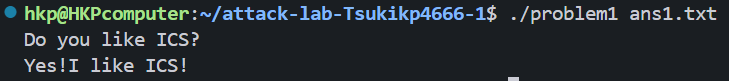
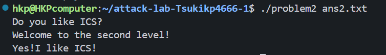
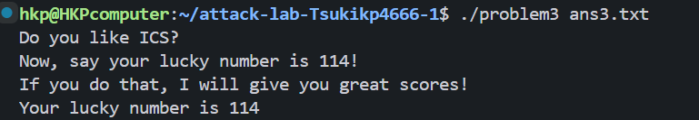
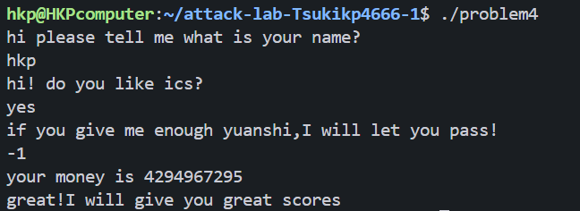

# 栈溢出攻击实验

## 题目解决思路


### Problem 1: 
- **分析**：
1. 找出漏洞，`strcpy`
2. 分析栈帧结构：
    （1）缓冲区：8个字节
    （2）旧的rbp：8个字节
    （3）返回地址：8个字节
    通过这个可得`padding`应为16个字节，即16个`'A'`
3. 修改返回地址：
    实验目标是输出`"Yes!I like ICS!"`，实现这个功能的函数为`func1`，所以我们需要修改返回地址为`func1`的地址（即0x401216）
- **解决方案**：
```py
padding = b"A" * 16  # 填充16字节到返回地址
func1_address = b"\x16\x12\x40\x00\x00\x00\x00\x00"  # func1地址 0x401216 小端格式
payload = padding + func1_address
```
- **结果**：附上图片


### Problem 2:
- **分析**：
这个问题的难点在于只有传入`func2`的参数为`0x3f8`才会输出目标语句。所以我的思路是让`rdi`中的值为`0x3f8`再跳转到`func2`。
1. 8字节的buffer和8字节的旧`rbp`共同构成16字节的`padding`。
2. 在汇编中找到辅助函数`<pop_rdi>`，通过这个跳板，把参数存入栈中，执行这条语句时则会把参数存入`rdi`中
3. 最后利用`ret`跳到`func2`，这样就可以顺利输出目标语句
4. 最终栈上布局：
    （1）`func2`的地址
    （2）参数`0x3f8`
    （3）`pop rdi`这条指令地址
    （4）16字节的`padding`
- **解决方案**：
```py
padding = b"A" * 16
# 目标函数地址
func2_addr = b"\x16\x12\x40\x00\x00\x00\x00\x00"
pop_rdi_addr = b"\xc7\x12\x40\x00\x00\x00\x00\x00"
# func2需要的参数
arg = b"\xf8\x03\x00\x00\x00\x00\x00\x00"
payload = padding + pop_rdi_addr + arg + func2_addr
```
- **结果**：附上图片


### Problem 3: 
- **分析**：
这个应该是最难的一个，它无法直接利用程序中现有的完整函数实现目标输出，且由于栈随机化等因素，硬编码栈地址往往不可靠。因此，我的思路是利用“可执行栈”注入 Shellcode，并配合程序提供的特殊跳转跳板。

1. 漏洞与偏移量分析：
    在 func 函数中，`memcpy` 向 `rbp-0x20` 处写入了 64 字节数据。缓冲区（32字节）加上旧的 `rbp`（8字节）共有 40 字节的偏移空间。

2. 寻找跳转跳板：
    汇编中存在一个特殊的函数 `<jmp_xs>`。分析其逻辑发现，它会加载之前保存在内存中的栈顶指针并加上 0x10。
    计算：`Saved_RSP + 0x10` 正好指向缓冲区起始位置偏移 8 字节处。这提供了一个极其稳定的“相对跳转”机制，无论栈真实地址如何变化，都能精准跳回我们的输入区域。

3. 构造 Shellcode：
由于需要输出幸运数字 114，我们构造了一段 10 字节的机器码：`\x6a\x72\x5f\xb8\x16\x12\x40\x00\xff\xd0`。
其逻辑为：
（1）`push 0x72; pop rdi`：将 114 (十六进制为0x72) 传入参数寄存器 rdi。
（2）`mov eax, 0x401216; call rax`：手动调用 func1 的入口。

4. 最终栈上布局：
（1）覆盖返回地址为 `jmp_xs` 的地址。
（2）填充 `Padding 2`，使从缓冲区开头到返回地址的长度正好为 40 字节。
（3）布置 `Shellcode`。
（4）开头放置 8 字节的 `Padding 1`（因为 jmp_xs 逻辑会跳过缓冲区的前 8 个字节）。
- **解决方案**：
```py
padding1 = b"A" * 8
shellcode = b"\x6a\x72\x5f\xb8\x16\x12\x40\x00\xff\xd0"
# 计算padding2的长度
current_len = 8 + len(shellcode)
padding2 = b"A" * (40 - current_len)
# 覆盖返回地址为 jmp_xs (0x401334)
jmp_xs_address = b"\x34\x13\x40\x00\x00\x00\x00\x00"
payload = padding1 + shellcode + padding2 + jmp_xs_address
```
- **结果**：附上图片


### Problem 4: 
- **分析**：
1. `func`函数逻辑：
    （1）读取输入
    （2）比较：比较输入和`0xfffffffe`，由于做的是无符号的比较，且只有输入大于这个数才会跳转，所以不难猜得输入应该是-1（其实在这里跳转后的逻辑并不需要看懂就可以猜到，因为除了-1以外输入别的执行都是一样的，显然答案应该是最特殊的-1）
    （3）循环计算：每次对输入减1，减`0xfffffffe`次，最后为1
    （4）最终检查：`cmpl $1, -0x18(%rbp)`和`cmpl $1, -0xc(%rbp)`连个条件都满足则调用`func1`
2. Canary保护机制分析
    （1）Canary的设置
    ```asm
    136c:	64 48 8b 04 25 28 00 	mov    %fs:0x28,%rax
    1373:	00 00 
    1375:	48 89 45 f8          	mov    %rax,-0x8(%rbp)
    ```
    （2）Canary的检查：如果试图通过缓冲区溢出覆盖返回地址，则会覆盖Canary值，调用`__stack_chk_fail`直接报错
    ```asm
    140a:	48 8b 45 f8          	mov    -0x8(%rbp),%rax
    140e:	64 48 2b 04 25 28 00 	sub    %fs:0x28,%rax
    1415:	00 00 
    1417:	74 05                	je     141e <func+0xc1>
    1419:	e8 b2 fc ff ff       	call   10d0 <__stack_chk_fail@plt>
    141e:	c9                   	leave
    ```
- **解决方案**：先输入名字和回答是否喜欢ics后，根据之前分析输入-1即可，所以真的如提示说的不需要额外写代码
- **结果**：附上图片


## 思考与总结
相比于其他lab来说，这并不是一个很复杂的lab，而且在`bomblab`的基础上，对于汇编有了一定的熟练度。尽管如此，第三个problem我依旧没能独自攻克，借助AI的帮助才得以完成。`ROP`链真的是一个很妙的东西，通过构造跳来跳去，最终跳到目标位置。`problem2`和`problem3`两个设计得都很巧妙，对于为什么叫attack这个名字也有了更为具体的认知。(或许期末考前写了这个lab，Canary那题也能写得更游刃有余一些)。
这是我这学期最后写的一个lab，想做个小总结：ICS的这些lab让我第一次接触WSL和第一次尝试在git hub克隆仓库。虽然写lab的过程有些痛苦，但是不可否认这是非常有收获的，对于理解知识有很大的帮助。
如果助教有看到这里，请让我向你们表示衷心的感谢和崇拜！

